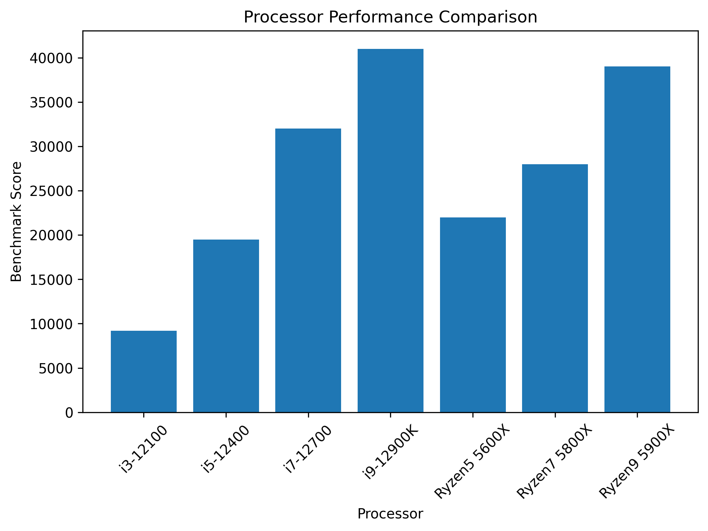
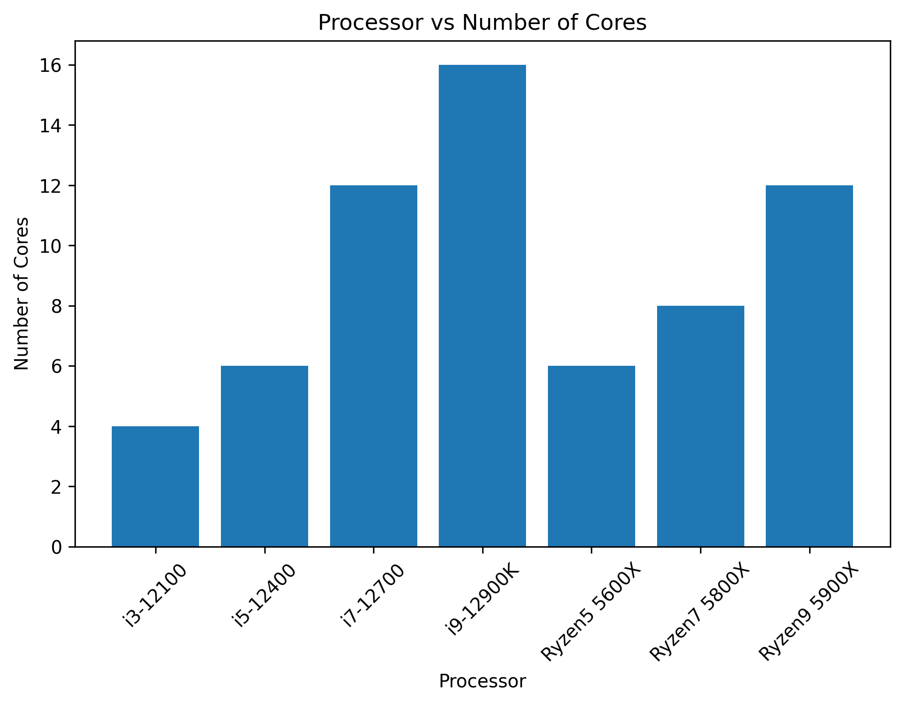
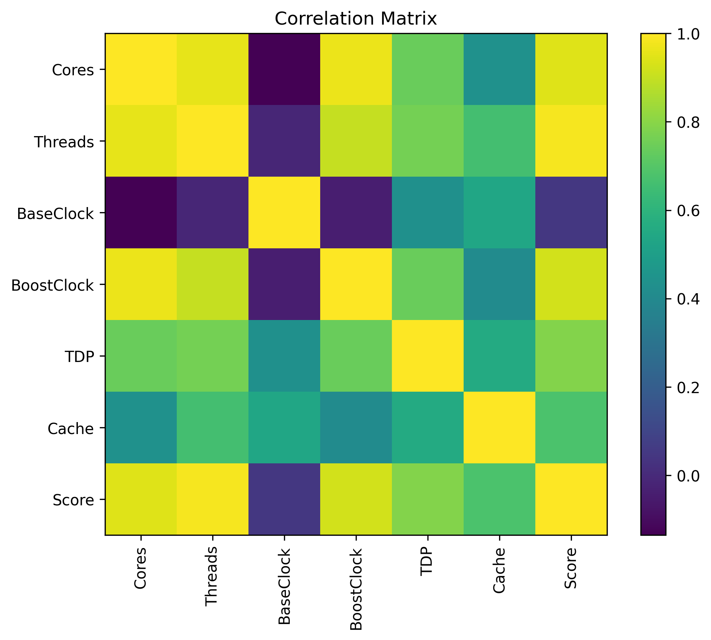
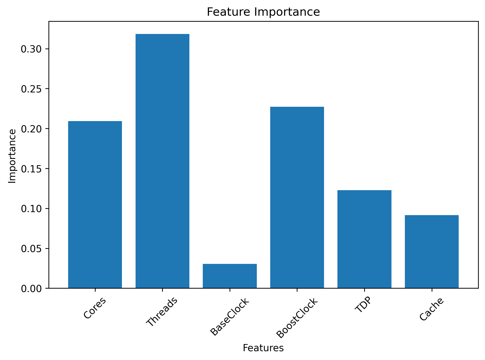

# 🖥️ AI-Based Microprocessor Performance Analysis Using Python and Machine Learning

## 📌 Project Overview

This project analyzes the performance of different microprocessors using **Python** and **Machine Learning**. It compares processor specifications, visualizes performance using graphs, and predicts benchmark scores using the **Random Forest Regression** algorithm.

The project demonstrates how data analysis and machine learning can be applied to understand processor performance based on hardware specifications.

---

## 🎯 Objectives

- Analyze processor specifications.
- Compare processor performance.
- Visualize processor data using graphs.
- Study the relationship between different processor features.
- Build a Machine Learning model.
- Predict benchmark scores for processors.

---

## 🛠️ Technologies Used

- Python
- Google Colab
- Pandas
- NumPy
- Matplotlib
- Scikit-learn

---

## 📂 Project Structure

```
AI-Based-Microprocessor-Performance-Analysis
│
├── README.md
├── analysis.ipynb
├── processors.csv
├── requirements.txt
├── LICENSE
├── graph1.png
├── graph2.png
├── graph3.png
└── correlation.png
```

---

## 📊 Dataset

The dataset contains sample processor specifications, including:

- Processor Name
- Number of Cores
- Number of Threads
- Base Clock Speed
- Boost Clock Speed
- Cache Memory
- Thermal Design Power (TDP)
- Benchmark Score

The dataset was created for educational purposes to demonstrate data analysis and machine learning techniques.

---

## ⚙️ Project Workflow

1. Create and load the processor dataset.
2. Perform exploratory data analysis.
3. Visualize processor specifications and benchmark scores.
4. Analyze feature relationships using a correlation matrix.
5. Train a Random Forest Regression model.
6. Predict benchmark scores for new processor specifications.
7. Evaluate the model using performance metrics.

---

## 📈 Visualizations

### Processor Performance Comparison



---

### Processor Core Comparison



---

### Correlation Matrix



---

### Feature Importance



---

## 🤖 Machine Learning Model

**Algorithm Used:**
- Random Forest Regressor

**Evaluation Metrics:**
- Mean Absolute Error (MAE)
- R² Score

The model learns the relationship between processor specifications and benchmark scores and predicts the performance of new processors.

---

## 🚀 Future Scope

- Use a larger real-world processor dataset.
- Include processors from Intel, AMD, Apple, and ARM.
- Develop a web application for processor performance prediction.
- Improve prediction accuracy using advanced Machine Learning algorithms.
- Build an interactive dashboard for visualization.

---

## ▶️ How to Run the Project

1. Clone the repository.
2. Install the required libraries:

```bash
pip install -r requirement.txt
```

3. Open `analysis.ipynb` in Google Colab or Jupyter Notebook.
4. Run all cells sequentially.
5. View the graphs and prediction results.

---

## 📚 Learning Outcomes

Through this project, I learned:

- Data preprocessing using Pandas.
- Data visualization using Matplotlib.
- Exploratory Data Analysis (EDA).
- Correlation analysis.
- Machine Learning using Scikit-learn.
- Model training and prediction.
- GitHub project management.

---

## 👩‍💻 Author

**Zunaira Khan**

AI Engineering Student

---

## ⭐ If you found this project useful, consider giving it a star!
